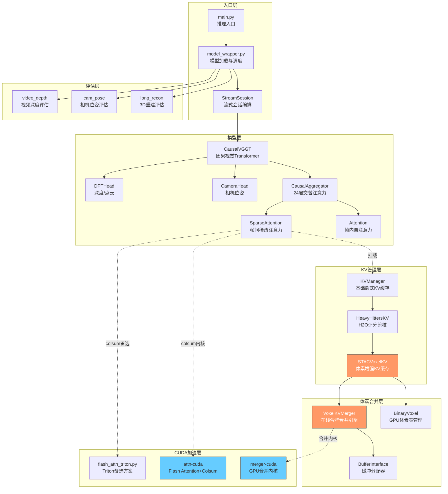
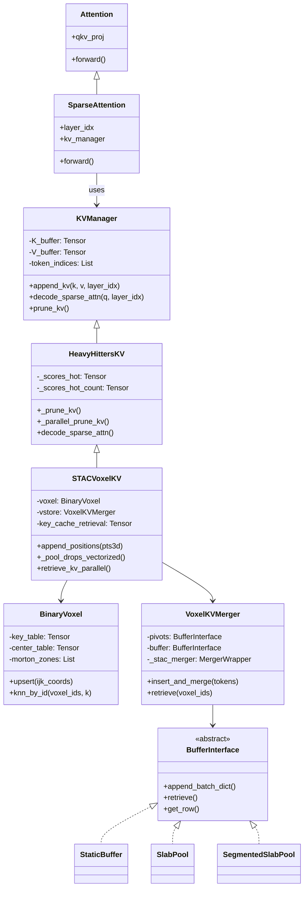

# STAC 项目分析报告

## 总述

STAC（Sparse Token Attention Cache）是一个面向长视频流式 3D 重建的即插即用 KV-cache 模块。其核心思想是：**将因果视觉 Transformer 中随时间被驱逐的 KV 令牌压缩到一个 3D 体素池中，并在需要时按空间邻近性检索回热缓存**。

该方案解决了长视频推理中 KV 缓存随帧数线性增长导致显存溢出的问题，同时通过体素化的空间压缩保持了长程时空一致性，在 3D 重建、相机位姿估计和视频深度估计等下游任务中表现出色。

项目架构分为五个层次：**模型层**（CausalVGGT 视觉 Transformer）、**KV 管理层**（多级缓存压缩策略）、**体素合并层**（在线令牌聚类合并）、**CUDA 加速层**（自研 Flash Attention 与合并内核）和**流式会话层**（帧级推理编排）。

---

## 分述

### 1. 模型层 — CausalVGGT

**位置**: `causalvggt/`

基于 VGGT（Visual Geometry Grounded Transformer）改造的因果视觉 Transformer 主干网络，支持流式逐帧推理。

- **CausalAggregator** (`causalvggt/models/aggregator.py`): 24 层 ViT-L，采用交替注意力机制（帧内全局注意力 + 帧间稀疏注意力）。帧内注意力处理单帧内部空间关系，帧间注意力处理跨帧时序关系。每层可挂载一个 `kv_manager` 来接管 KV 缓存的读写。
- **SparseAttention** (`causalvggt/layers/attention.py`): 继承自标准 Attention，在 forward 时不再直接计算注意力，而是将 K/V 追加到 `kv_manager`，再由 `kv_manager.decode_sparse_attn()` 完成稀疏注意力计算。
- **Heads**: `CameraHead`（相机位姿估计）、`DPTHead`（深度图 + 3D 点云预测）、`TrackHead`（点跟踪）。

### 2. KV 管理层 — 多级缓存策略

**位置**: `stac/kv_manager.py`, `stac/h2o.py`, `stac/stac_voxel.py`

采用继承式设计，从基础窗式缓存到完整的体素增强缓存，逐级扩展功能：

```
KVManager  →  HeavyHittersKV  →  STACVoxelKV
 (基础窗式)     (H2O 评分剪枝)       (体素空间压缩)
```

- **KVManager** — 基础滑窗 KV 缓存。在 GPU 上维护一个预分配环形缓冲区，支持 CPU 溢出。剪枝策略：保留最近 N 帧 + 固定帧，其余丢弃。
- **HeavyHittersKV** — 引入 H2O（Heavy Hitter Oracle）评分机制。每次注意力计算时通过列求和（column-sum）累积每个令牌的重要性分数，剪枝时额外保留分数最高的 Top-K 令牌。支持逐层串行剪枝和全层并行剪枝两种模式。
- **STACVoxelKV** — 完整的 STAC 实现。在 H2O 基础上增加：
  - **3D 体素化**：将每个令牌对应的 3D 空间坐标量化到体素网格
  - **驱逐令牌池化**：被剪枝的令牌不再丢弃，而是批量写入 `VoxelKVMerger` 进行在线合并
  - **按需检索**：每个注意力步骤前，根据当前令牌的空间邻近关系，从体素池中检索历史枢轴令牌

### 3. 体素合并层 — 在线空间聚类

**位置**: `stac/merger.py`, `stac/voxel.py`, `stac/allocator.py`

- **VoxelKVMerger** — 在线令牌合并引擎。每个（注意力头, 体素）单元维护两组存储：
  - **Buffer**（B 容量）：暂存尚未聚类的令牌
  - **Pivot Pool**（P 容量）：压缩后的枢轴表示

  合并策略采用"先合并后缓存"：新令牌先与已有枢轴做余弦相似度匹配，相似者加权平均合并；低相似高分令牌进入 Buffer；Buffer 满时触发 Weighted-FPS 聚类生成新枢轴；枢轴池满时合并最轻量枢轴到最近邻居。

- **BinaryVoxel** — GPU 端增量体素表管理器。将 3D 整数网格坐标编码为 1D 打包键（bit-shift 编码），维护有序主表支持二分查找，通过 Morton（Z 序）分区实现空间局部性优化，支持 Chebyshev 立方体近邻搜索。

- **BufferInterface / SlabPool / SegmentedSlabPool** (`stac/allocator.py`) — 缓冲分配器层次结构，提供静态预分配、惰性物化 Slab 池和微 Slab 分段池三种策略，减少 GPU 显存碎片。

### 4. CUDA 加速层

**位置**: `attn-cuda/`, `merger-cuda/`, `stac/flash_attn_triton.py`

- **attn-cuda**: 基于 CUTLASS 的 Flash Attention，支持向量偏置和列求和输出（用于 H2O 评分），D=64，fp16/bf16，SM80+，单次内核启动同时输出注意力结果和令牌重要性分数。
- **merger-cuda**: 有状态的 C++ MergerWrapper 类，在 GPU 端实现 `insert_and_merge_with_rows()` 和 `retrieve()` 的融合内核，将相似度计算、合并、缓冲追加、聚类、枢轴替换等操作合并为单次 GPU 内核调用。
- **flash_attn_triton.py**: Triton 实现的 Flash Attention 备选方案，提供多种列求和内核变体（atomics、非 atomics、查询子采样、split-K 归约），在无 CUDA 扩展环境下降级使用。

### 5. 流式会话层

**位置**: `stream_session.py`, `model_wrapper.py`, `main.py`

- **StreamSession** (`stream_session.py`): 流式推理编排器，管理完整的帧级推理生命周期：KV 管理器注册 → 逐帧前向传播 → 相机位姿推断 → 点云提取 → KV 位置更新 → 体素检索 → 剪枝驱逐 → 体素池合并 → 预测累积。
- **model_wrapper.py**: 模型加载与运行调度。`load_model()` 加载 CausalVGGT 预训练权重，`run_model()` 将用户简写模式（如 `stac`）展开为完整配置并调度 StreamSession 或直接模型调用。
- **main.py**: 最小推理入口，命令行参数解析、图片加载、模型推理、结果解码输出。

---

## 数据流

```
输入帧序列 [S, 3, H, W]
    │
    ▼
┌─────────────────────────────────────────────────────┐
│  PatchEmbed (DINOv2 ViT-L/14) → patch tokens        │
│  添加 Camera Token + Register Tokens                │
└─────────────────────────────────────────────────────┘
    │
    ▼  (24 层交替注意力)
┌─────────────────────────────────────────────────────┐
│  Frame Attention (Block + Attention)                │  ← 帧内自注意力
│  Global Attention (Block + SparseAttention)         │  ← 帧间稀疏注意力
│    ├─ append_kv(k, v)           → KVManager         │
│    ├─ decode_sparse_attn(q)     ← KVManager (热缓存) │
│    └─ colsum 累积 → H2O 评分                        │
└─────────────────────────────────────────────────────┘
    │
    ▼
┌─────────────────────────────────────────────────────┐
│  CameraHead → 位姿编码 → 外参 + 内参                 │
│  DPTHead → 深度图 + 3D 点云                          │
└─────────────────────────────────────────────────────┘
    │
    ▼
┌─────────────────────────────────────────────────────┐
│  update_kv_mgr_pos(3D点云)                          │
│    ├─ 量化到体素网格 → BinaryVoxel.upsert()         │
│    └─ 空间近邻搜索                                  │
└─────────────────────────────────────────────────────┘
    │
    ▼
┌─────────────────────────────────────────────────────┐
│  retrieve_kv_mgr() (周期性)                         │
│    └─ VoxelKVMerger.retrieve(邻居体素) → 检索缓存   │
└─────────────────────────────────────────────────────┘
    │
    ▼
┌─────────────────────────────────────────────────────┐
│  prune_kv_mgr()                                     │
│    ├─ 保留: recent + pinned + H2O top-k             │
│    ├─ 被驱逐令牌 → _pool_drops_vectorized()          │
│    │    └─ 按体素分组 → VoxelKVMerger.insert_and_merge│
│    └─ 压缩热缓存                                    │
└─────────────────────────────────────────────────────┘
```

---

## 核心配置参数

| 参数 | 默认值 | 说明 |
|------|--------|------|
| `mode` | `stac` | 注意力模式：`full` / `causal` / `window_kv` / `window_chunk_merge` / `stac` |
| `window_size` | 4 | 热缓存中保留的最近帧数 |
| `chunk_size` | 4 | 每步处理的帧数 |
| `hh_size` | 2 | H2O 保留的高分帧数 |
| `retrieval_size` | 2 | 每层从体素池检索的最大令牌数 |
| `voxel_size` | 0.05 | 3D 体素尺寸（世界单位） |
| `voxel_piv_cap` | 4 | 每（头, 体素）的枢轴容量 |
| `voxel_buf_cap` | 8 | 每（头, 体素）的缓冲容量 |
| `sim_threshold` | 0.8 | 合并到枢轴的余弦相似度阈值 |
| `temperature` | 0.9 | H2O 分数累积温度系数 |
| `attn_backend` | `cuda` | 注意力后端：`cuda` / `triton` |
| `voxel_backend` | `cuda` | 合并后端：`cuda` / `python` |
| `allocator` | `segment` | 缓冲分配器：`static` / `slab` / `segment` |

---

## Mermaid 架构图



### 类继承关系



---

## 技术亮点

1. **时空联合压缩**: 传统 KV 缓存仅在时间维度做滑窗或评分剪枝，STAC 创新性地引入 3D 空间体素化，将驱逐令牌按世界坐标聚类存储，实现长程空间记忆。

2. **在线合并算法**: "先合并后缓存"策略（相似匹配 → 加权平均合并 → 缓冲暂存 → 聚类生成枢轴）在 GPU 上实现增量式在线聚类，避免了离线后处理的开销。

3. **列求和评分机制**: 利用 Flash Attention 的中间结果（softmax 行和）作为令牌重要性指标，无需额外计算开销即可获得 H2O 评分，且支持查询子采样加速。

4. **CUDA 全栈加速**: 自研 CUTLASS Flash Attention（支持偏置 + 列求和）和 GPU 端合并内核（融合相似度计算、聚类、枢轴替换），单次内核调用完成完整合并流水线。

5. **灵活的分配器设计**: Static / Slab / SegmentedSlab 三级分配器层次，适应不同显存场景，SegmentedSlabPool 通过微 Slab（如 32→8）减少内部碎片。

---

## 目录结构概览

```
STAC/
├── main.py                     # 推理入口
├── model_wrapper.py            # 模型加载与调度
├── stream_session.py           # 流式会话编排
├── causalvggt/                 # 因果 VGGT 主干网络
│   ├── models/                 #   vggt.py, aggregator.py
│   ├── layers/                 #   attention.py, block.py, rope.py...
│   ├── heads/                  #   camera_head.py, dpt_head.py...
│   └── utils/                  #   几何、位姿、加载工具
├── stac/                       # STAC KV 缓存核心
│   ├── kv_manager.py           #   基础窗式 KV 缓存
│   ├── h2o.py                  #   H2O 评分剪枝
│   ├── stac_voxel.py           #   体素增强 KV 缓存
│   ├── merger.py               #   在线令牌合并引擎
│   ├── voxel.py                #   GPU 体素表管理
│   ├── allocator.py            #   缓冲分配器
│   └── flash_attn_triton.py    #   Triton Flash Attention
├── attn-cuda/                  # CUDA Flash Attention 扩展
├── merger-cuda/                # CUDA 合并内核扩展
├── eval/                       # 评估脚本
│   ├── long_recon/             #   3D 重建评估
│   ├── cam_pose/               #   相机位姿评估
│   └── video_depth/            #   视频深度评估
└── ckpt/                       # 预训练权重
```
