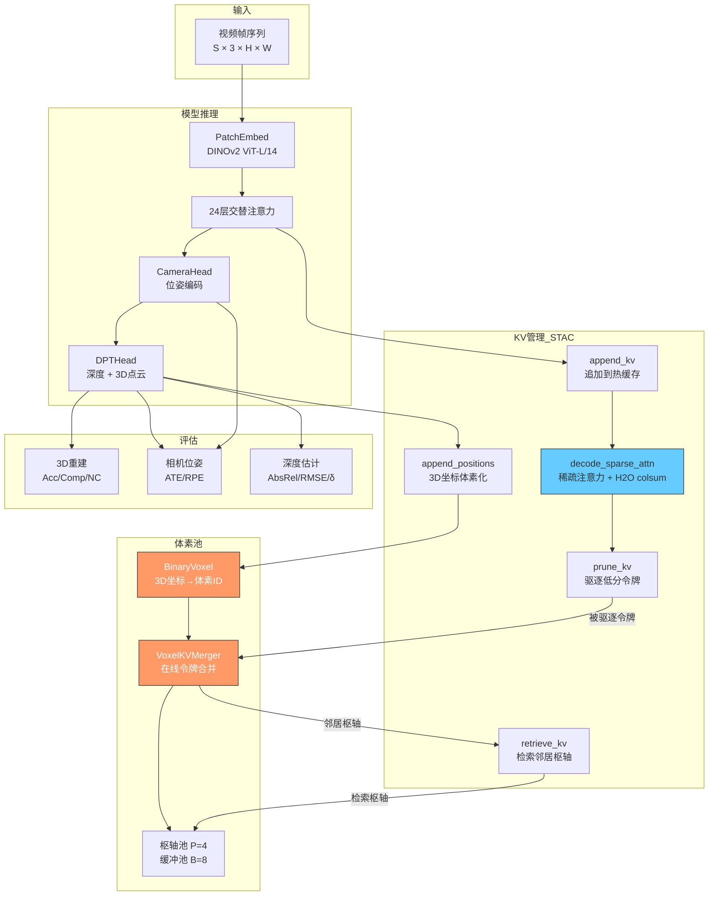
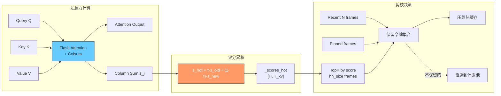

# STAC 项目代码设计、计算方式、实验设置与性能指标分析

## 总述

STAC（Sparse Token Attention Cache）项目围绕**"时空联合 KV 缓存压缩"**这一核心思想，构建了一套从模型推理、缓存管理、在线体素合并到下游评估的完整系统。其代码设计遵循**分层解耦、策略可插拔**原则，计算方式以**GPU 端在线聚类合并**和**H2O 评分驱动剪枝**为两大核心算法，实验设置覆盖 3D 重建、相机位姿估计和视频深度估计三大任务，性能指标采用学术界标准评估协议。

---

## 一、代码设计

### 1.1 总体架构设计

项目采用**五层分层架构**，层与层之间通过明确定义的接口通信：

```
┌──────────────────────────────────────────────┐
│  入口层: main.py / model_wrapper.py           │  ← 命令行解析、模型加载、运行调度
├──────────────────────────────────────────────┤
│  会话层: stream_session.py (StreamSession)    │  ← 逐帧推理编排、KV 管理器生命周期
├──────────────────────────────────────────────┤
│  模型层: causalvggt/                          │  ← ViT-L 主干 + 多任务预测头
├──────────────────────────────────────────────┤
│  KV 管理层: stac/ (三级继承体系)              │  ← 滑窗缓存 → H2O 评分 → 体素增强
├──────────────────────────────────────────────┤
│  CUDA 加速层: attn-cuda/ + merger-cuda/       │  ← 自研 Flash Attention + GPU 合并内核
└──────────────────────────────────────────────┘
```

**设计原则**：
- **策略可插拔**：通过 `--mode` 参数在 `full` / `causal` / `window_kv` / `window_chunk_merge` / `stac` 之间切换
- **继承式扩展**：`KVManager → HeavyHittersKV → STACVoxelKV` 逐级增加功能
- **后端双轨**：CUDA（高性能）和 Python/Triton（可移植）双后端，自动选择

### 1.2 模型层设计

**CausalVGGT** (`causalvggt/models/vggt.py`) 是核心模型，继承 `nn.Module` 和 `PyTorchModelHubMixin`：

```
CausalVGGT
├── CausalAggregator (24 层交替注意力)
│   ├── PatchEmbed (DINOv2 ViT-L/14)
│   ├── RotaryPositionEmbedding2D
│   ├── Frame Blocks × 12 (Block + Attention)
│   └── Global Blocks × 12 (Block + SparseAttention)
├── CameraHead → 位姿编码 → 外参 + 内参
├── DPTHead × 2 → 深度图 + 3D 点云
└── TrackHead → 点跟踪
```

**交替注意力机制**：24 层按 `["frame", "global"]` 交替排列（`aa_block_size=1`）。Frame attention 处理单帧内空间关系（标准自注意力），Global attention 处理跨帧时序关系（通过 SparseAttention 挂载 KV 管理器）。

**SparseAttention 设计** (`causalvggt/layers/attention.py`)：
```python
class SparseAttention(Attention):
    def forward(self, x, ...):
        q, k, v = self.qkv_proj(x)
        # 不再直接计算注意力，而是委托给 kv_manager
        self.kv_manager.append_kv(k, v, self.layer_idx)
        attn_out = self.kv_manager.decode_sparse_attn(q, self.layer_idx)
        return attn_out
```

这种设计将注意力计算的控制权完全移交给 KV 管理器，使得缓存策略可以独立演进而不修改模型代码。

### 1.3 KV 管理层设计

**三级继承体系**是 STAC 最核心的设计：

```
KVManager                    # 基础滑窗缓存
  │  - GPU 环形缓冲区 [L, H, T_buffer, D]
  │  - CPU 溢出支持
  │  - append_kv / decode_sparse_attn / prune_kv
  │  - 剪枝策略：保留 recent + pinned
  │
  └─→ HeavyHittersKV         # H2O 评分机制
       │  - _scores_hot: 每头每令牌累积评分
       │  - decode_sparse_attn 返回 colsum 用于评分
       │  - 剪枝策略：recent + pinned + Top-K H2O
       │  - 支持逐层串行剪枝和全层并行剪枝
       │
       └─→ STACVoxelKV        # 体素空间压缩
           - BinaryVoxel: 3D 体素化管理
           - VoxelKVMerger: 在线令牌合并
           - 检索缓存: 空间邻居枢轴令牌
```

**关键数据流**：每步推理按严格顺序执行：
1. `append_kv(k, v)` — 新 K/V 追加到热缓存
2. `append_positions(pts3d)` — 更新 3D 坐标，体素化
3. `decode_sparse_attn(q)` — 计算稀疏注意力 + 累积 H2O 评分
4. `prune_kv()` — 驱逐低分令牌到体素池
5. `retrieve_kv()` — 从体素池检索空间邻居令牌

### 1.4 缓冲分配器设计

`stac/allocator.py` 提供三级分配器层次：

```
BufferInterface (ABC)
├── StaticBuffer      — 全量预分配，无动态扩展
├── SlabPool          — 惰性物化 + 行→槽位映射
└── SegmentedSlabPool — 微 Slab 分段（如 B=32, seg=8）
                        减少内部碎片，CUDA 合并模式使用
```

每个 Buffer 维护状态机：`AVAILABLE → RESERVED → FULL → HELD → FREE`，支持按行的 append/replace/free 操作。

---

## 二、计算方式与核心算法

### 2.1 H2O（Heavy Hitter Oracle）评分机制

**数学定义**：

对于注意力计算 $\text{Attention}(Q, K, V) = \text{softmax}\left(\frac{QK^T}{\sqrt{d}}\right)V$，定义**列求和（column-sum）**为：

$$s_j = \sum_{i=1}^{T_q} \text{softmax}\left(\frac{QK^T}{\sqrt{d}}\right)_{i,j}$$

即 softmax 矩阵沿查询维度的列和。$s_j$ 衡量第 $j$ 个 Key 令牌对所有 Query 令牌的总贡献，作为该令牌的重要性分数。

**累积与温度缩放**：

```python
# 每步累积（h2o.py）
new_scores = colsum_output  # [H, T_kv]
self._scores_hot = temperature * self._scores_hot + (1 - temperature) * new_scores
```

温度系数 `temperature`（默认 0.9）控制历史分数的衰减速度。

**计算方式**：

- **CUDA 路径**：`attn-cuda` 的 `flash_attn_bias_colsum()` 在单次内核中同时完成注意力计算和列求和
- **Triton 路径**：`flash_attn_triton.py` 提供多种内核变体：
  - `fa_forward_colsum_fast`: 无 atomics，N-major 列求和
  - `fa_forward_colsum_fast_sub`: 查询子采样加速（默认 subsample=1.0）
  - `fa_forward_colsum_fast_beta`: Split-K 归约方案

**查询子采样加速**：在计算 colsum 时，仅对 $\lfloor T_q \times \text{subsample} \rfloor$ 个查询令牌采样，大幅减少 colsum 阶段的 FLOPs，同时保持排名质量。

### 2.2 在线体素合并算法（VoxelKVMerger）

这是 STAC 最核心的算法创新，实现在 `stac/merger.py` 中。

**数据结构**：每个（注意力头 $h$，体素 $v$）维护：
- **Pivot Pool**：$P$ 个枢轴，存储合并后的压缩表示 $(\mathbf{K}_p, \mathbf{V}_p, w_p, s_p, c_p)$
- **Buffer**：$B$ 个槽位，暂存未聚类的令牌

**"先合并后缓存"（Merge First）策略**：

```
对于每个 (h, v) 单元的输入令牌 {k_i, v_i, score_i}：

1) 如果存在已有枢轴：
   a. 计算每个令牌与所有枢轴种子向量的余弦相似度
   b. 若 sim >= sim_threshold（默认 0.8）：
      → 加权平均合并到最近的枢轴
   c. 若 sim < replace_threshold（默认 0.8）且 score > row_avg × score_threshold（默认 0.2）：
      → 追加到 Buffer（低相似度高分令牌）
   d. 否则：丢弃（低质量令牌）

2) 如果 Buffer 已满：
   a. Weighted-FPS 聚类：以最高分令牌为种子，
      按 cos(种子, 令牌) 加权的系数对所有 Buffer 令牌加权平均 → 新枢轴
   b. 若枢轴池已满：
      → 选择权重最小的枢轴，合并到其最近邻居（按种子相似度加权）
      → 释放槽位
   c. 插入新枢轴

3) 溢出令牌（无法合并且 Buffer 已满）：保留到下一时间步
```

**Weighted-FPS 聚类**（`_cluster_merge_to_one_budget`）：

$$k_{\text{pivot}} = \sum_i \frac{w_i}{\sum_j w_j} \cdot k_i, \quad w_i = \exp(\text{sim}(k_i, k_{\text{seed}})) \cdot \text{score}_i$$

$$v_{\text{pivot}} = \sum_i \frac{w_i}{\sum_j w_j} \cdot v_i$$

$$w_{\text{pivot}} = \sum_i w_i \cdot c_i, \quad s_{\text{pivot}} = \sum_i s_i, \quad c_{\text{pivot}} = \sum_i c_i$$

**枢轴再合并**（`_append_to_pivots` 中的 remerge）：
当枢轴池满时，选择贡献权重 $w_p$ 最小的枢轴 $v$，找到其最近邻居 $n$（按种子余弦相似度），按权重加权合并：

$$k_n' = \frac{w_v \cdot e^{\text{sim}-1}}{w_v \cdot e^{\text{sim}-1} + w_n} \cdot k_v + \frac{w_n}{w_v \cdot e^{\text{sim}-1} + w_n} \cdot k_n$$

**检索 logit bias**：检索时枢轴的 logit bias = $\log(c)$（令牌计数），Buffer 令牌 bias = 0。这使得注意力机制自然地倾向于合并了更多令牌的枢轴。

### 2.3 体素化管理（BinaryVoxel）

**坐标编码**（`_pack_keys_1d`）：

对于 3D 整数网格坐标 $(i, j, k)$，编码为 1D 键：
$$\text{key} = (i + 2^{20}) + (j + 2^{20}) \cdot 2^{21} + (k + 2^{20}) \cdot 2^{42}$$

**增量插入**（`upsert`）：
1. 将新坐标编码为 1D 键
2. 通过二分搜索（`torch.searchsorted`）在已排序的主表中查找
3. 存在的键 → 返回已有体素 ID；新键 → 追加到主表末尾
4. 全局重新计算 Morton 分区（平衡分布）

**空间近邻搜索**（`knn_by_id`）：
使用 Chebyshev 立方体邻域 $[-R, R]^3$，预计算所有偏移的 1D 键增量，对每个查询体素 Broadcast-add 得到候选键矩阵，批量查找 → 计算欧几里得距离 → Top-K。

**Morton 平衡分区**（`_balanced_morton_zone`）：
- 为每个体素计算细粒度 Morton（Z-order）码
- 按 Morton 码排序
- 将排序序列均匀切分为 N 个 zone
- 稠密区域自动获得更多 zone（更细粒度），稀疏区域共享更少 zone

### 2.4 GPU 端合并内核（merger-cuda）

CUDA MergerWrapper 在 GPU 端实现完整的合并流水线，关键操作：

```
insert_and_merge_with_rows(rows, keys, values, scores):
    for each unique (head, voxel) segment:
        1. 加载现有枢轴到共享内存
        2. 计算令牌→枢轴余弦相似度（tile 矩阵乘法）
        3. 相似度阈值过滤 → 加权平均合并
        4. 低相似度高分令牌 → Buffer 追加
        5. Buffer 满 → Weighted-FPS 聚类 → 新枢轴
        6. 枢轴池满 → 再合并最轻枢轴
```

支持 Segmented 模式（`seg_mode=True`）：每段 1 个令牌，通过微 Slab 消除内部碎片，减少显存占用。

### 2.5 并行剪枝算法

`HeavyHittersKV._parallel_prune_kv()` 同时处理所有托管层：

```python
# 所有层并行：
all_keep_idx = []
for each layer:
    keep = recent_tokens + pinned_tokens + topk_h2o_scores(scores, hh_size)
    all_keep_idx.append(keep)

# STACVoxelKV 额外步骤：
_pool_drops_vectorized():
    1. 提取被驱逐令牌的 K/V/scores/voxel_ids
    2. 按体素 ID 排序分组
    3. 批量调用 VoxelKVMerger.insert_and_merge()

# 所有层并行压缩：
_apply_keep_and_compact(all_keep_idx)
```

### 2.6 注意力掩码设计

`causalvggt/layers/block.py` 的 `create_attn_mask()` 支持四种模式：

| 模式 | 掩码策略 |
|------|----------|
| `causal` | 下三角因果掩码（每帧只能看到当前及之前的帧）|
| `window` | 滑动窗口掩码（每帧只能看到最近 W 帧）|
| `full` | 全注意力（所有帧互相可见）|
| `test` | 全注意力但保留因果顺序 |

掩码通过 PyTorch `flex_attention.create_block_mask` 创建块稀疏掩码，提升计算效率。

---

## 三、实验设置

### 3.1 评估任务与数据集

| 任务 | 数据集 | 评估脚本 | 指标 |
|------|--------|----------|------|
| 长视频 3D 重建 | 7Scenes, NRGBD, DTU | `eval/long_recon/launch.py` | Accuracy, Completion, NC, F-score |
| 相机位姿估计 | Sintel, ScanNet, TUM | `eval/cam_pose/launch.py` | ATE, RPE_trans, RPE_rot |
| 视频深度估计 | Sintel, KITTI, Bonn, NYU, ScanNet | `eval/video_depth/launch.py` | AbsRel, SqRel, RMSE, LogRMSE, δ<1.25 |

### 3.2 标准运行配置

```bash
# STAC 预设（推荐）
python main.py --scene_dir /path/to/scene --mode stac

# STAC 完整参数
python main.py --scene_dir /path/to/scene \
  --base_model stream3r --streaming \
  --mode window_chunk_merge \
  -win 4 -ck 4 -hh 2 -ret_sz 2 -ret_buf

# 基线：全注意力
python main.py --scene_dir /path/to/scene --mode full

# 基线：滑窗 KV
python main.py --scene_dir /path/to/scene --mode window_kv --streaming -win 8

# 基线：因果 KV
python main.py --scene_dir /path/to/scene --mode causal --streaming
```

### 3.3 STAC 预设参数（`model_wrapper.py`）

当 `--mode stac` 时自动展开为：

| 参数 | 值 | 说明 |
|------|-----|------|
| `mode` | `window_chunk_merge` | STAC 完整流水线 |
| `streaming` | `True` | 启用流式推理 |
| `window_size` | 4 | 热缓存最近 4 帧 |
| `chunk_size` | 4 | 每步处理 4 帧 |
| `hh_size` | 2 | H2O 保留 2 帧 |
| `retrieval_size` | 2 | 每层检索 2 个体素枢轴令牌 |
| `return_buf` | `True` | 检索时包含 Buffer 令牌 |

### 3.4 评估运行命令

```bash
# 3D 重建评估
python eval/long_recon/launch.py \
  --dataset_type NRGBD --scene_name complete_kitchen \
  --model_name causalvggt --base_model stream3r \
  --mode stac --streaming

# 相机位姿评估
python eval/cam_pose/launch.py \
  --dataset_type tum \
  --model_name causalvggt --base_model stream3r \
  --mode stac --streaming

# 视频深度评估（两步）
python eval/video_depth/launch.py \
  --eval_dataset sintel \
  --model_name causalvggt --base_model stream3r \
  --mode stac --streaming
python eval/video_depth/eval_depth.py --align scale
```

### 3.5 消融实验参数维度

通过调整以下参数进行消融实验：

| 参数 | 消融维度 | 典型取值 |
|------|----------|----------|
| `window_size` | 热缓存容量 | 0, 2, 4, 8, 16 |
| `hh_size` | H2O 评分有效性 | 0, 1, 2, 4 |
| `retrieval_size` | 检索令牌数 | 0, 1, 2, 4 |
| `voxel_size` | 体素分辨率 | 0.02, 0.05, 0.10 |
| `voxel_piv_cap` | 枢轴容量 | 2, 4, 8 |
| `voxel_buf_cap` | 缓冲容量 | 4, 8, 16 |
| `sim_threshold` | 合并相似度阈值 | 0.6, 0.75, 0.8, 0.9 |
| `temperature` | H2O 温度系数 | 0.5, 0.7, 0.9, 1.0 |
| `mode` | 整体策略 | full, causal, window_kv, stac |

---

## 四、性能指标设计

### 4.1 3D 重建指标

**Accuracy（准确率）**：
$$\text{Acc} = \frac{1}{|P_{\text{rec}}|} \sum_{p \in P_{\text{rec}}} \min_{q \in P_{\text{gt}}} \|p - q\|_2$$

重建点云中每个点到最近 GT 点的平均距离（通过 KD-Tree 查询，支持 GPU 加速的 Cupoch 后端）。

**Completion（完整率）**：
$$\text{Comp} = \frac{1}{|P_{\text{gt}}|} \sum_{q \in P_{\text{gt}}} \min_{p \in P_{\text{rec}}} \|q - p\|_2$$

GT 点云中每个点到最近重建点的平均距离。

**Normal Consistency（法向一致性）**：
$$\text{NC} = \frac{1}{|P|} \sum_{i} |\mathbf{n}_{\text{rec},i} \cdot \mathbf{n}_{\text{gt}, \text{nn}(i)}|$$

**ICP 对齐**：评估前使用 Iterative Closest Point 将预测点云对齐到 GT：
- DTU 数据集：阈值 = 100（毫米级）
- 其他数据集：阈值 = 0.1（米级）
- 使用 Point-to-Plane ICP（GPU 模式）或 Point-to-Point ICP（CPU 模式）

**Evaluation protocol**（来自 `criterion.py`）：

```python
# 1. Scale-Shift 不变对齐
Regr3D_t_ScaleShiftInv:
    - 计算中值深度 → 深度偏移对齐
    - 计算中值尺度 → 尺度归一化
    - 使用 L21 距离（欧几里得距离）

# 2. Confidence-weighted Loss
ConfLoss_t:
    loss = pixel_loss * conf - alpha * log(conf)
```

### 4.2 相机位姿估计指标

使用 [evo](https://github.com/MichaelGrupp/evo) 库的标准协议：

**ATE（Absolute Trajectory Error，绝对轨迹误差）**：
$$\text{ATE}_{\text{RMSE}} = \sqrt{\frac{1}{N} \sum_{i=1}^{N} \|\text{trans}(\mathbf{T}_{\text{gt},i}^{-1} \mathbf{T}_{\text{est},i})\|^2}$$

- 先通过 Horn 方法对齐两条轨迹（旋转 + 平移 + 尺度）
- 仅评估平移分量
- 统计量：rmse, mean, median, std, min, max

**RPE（Relative Pose Error，相对位姿误差）**：
$$\text{RPE}_{\text{trans}} = \sqrt{\frac{1}{N-\Delta} \sum_{i=1}^{N-\Delta} \|\text{trans}((\mathbf{T}_{\text{gt},i}^{-1}\mathbf{T}_{\text{gt},i+\Delta})^{-1} (\mathbf{T}_{\text{est},i}^{-1}\mathbf{T}_{\text{est},i+\Delta}))\|^2}$$

- $\Delta = 1$ 帧
- 分别评估平移分量（RPE_trans，单位：米）和旋转分量（RPE_rot，单位：度）
- `all_pairs=True`：对所有帧对计算

**首帧对齐末帧误差**（`eval_metrics_first_pose_align_last_pose`）：
- 仅用首帧 GT 位姿对齐预测轨迹
- 评估末帧位姿的 ATE
- 更严格地衡量累积漂移

### 4.3 视频深度估计指标

**标准深度误差指标**（`eval_depth()`）：

| 指标 | 公式 | 说明 |
|------|------|------|
| AbsRel | $\frac{1}{N}\sum \frac{\|d_{\text{pred}} - d_{\text{gt}}\|}{d_{\text{gt}}}$ | 绝对相对误差 |
| SqRel | $\frac{1}{N}\sum \frac{(d_{\text{pred}} - d_{\text{gt}})^2}{d_{\text{gt}}}$ | 平方相对误差 |
| RMSE | $\sqrt{\frac{1}{N}\sum (d_{\text{pred}} - d_{\text{gt}})^2}$ | 均方根误差 |
| LogRMSE | $\sqrt{\frac{1}{N}\sum (\log d_{\text{pred}} - \log d_{\text{gt}})^2}$ | 对数 RMSE |
| δ < 1.25 | $\% \text{ of } \max(\frac{d_{\text{pred}}}{d_{\text{gt}}}, \frac{d_{\text{gt}}}{d_{\text{pred}}}) < 1.25$ | 阈值准确率 |
| δ < 1.25² | 同上，阈值 = 1.25² | 宽松阈值 |
| δ < 1.25³ | 同上，阈值 = 1.25³ | 更宽松阈值 |

**深度对齐方法**：

| 方法 | 参数 | 公式 |
|------|------|------|
| Median scaling | `--align scale` | $d' = d \cdot \frac{\text{median}(d_{\text{gt}})}{\text{median}(d_{\text{pred}})}$ |
| Least squares | `--align lstsq` | $d' = s \cdot d + t$，$\arg\min_{s,t} \|s \cdot d + t - d_{\text{gt}}\|^2$ |
| LAD（最小绝对偏差） | `--align lad` | $\arg\min_{s,t} \|s \cdot d + t - d_{\text{gt}}\|_1$（Adam 优化） |
| Iterative reweighted | `--align scale` | Weiszfeld 方法迭代重加权最小二乘 |
| Metric scale | `--align metric` | 不做缩放（直接评估绝对深度） |

**预处理**：
- 过滤 GT 深度 > `max_depth`（默认 80m）的像素
- 过滤 AbsRel > 1.0 的离群值
- 可选的前/后裁剪（`pre_clip_min/max`, `post_clip_min/max`）

### 4.4 显存效率指标

KV 管理器通过 `get_memory_details()` 提供显存分解：

```python
{
    "total_usage": GPU_used + CPU_used,        # MB
    "total_alloc": GPU_alloc + CPU_alloc,      # MB
    "temporal_cache_usage": GPU_KV_cache_used,  # MB（热缓存）
    "temporal_cache_alloc": GPU_KV_cache_alloc, # MB
    "spatial_cache_usage": 0.0,                 # MB（体素池，由 VoxelKVMerger 单独统计）
}
```

VoxelKVMerger 通过 `info()` 提供压缩率统计：

```python
{
    "merge_compress_ratio": piv_data / token_count,     # 枢轴压缩率
    "best_compress_ratio":  data_count / token_count,   # 最优压缩率
    "real_compress_ratio":  alloc_count / token_count,  # 实际分配压缩率
    "pivot_pool_used": piv_data,
    "buffer_pool_used": buf_data,
}
```

### 4.5 性能指标计算流程

```
1. 模型推理 → 输出预测（pts3d / depth / camera_pose）

2. 深度任务：
   depth → 对齐（scale/lstsq/lad）→ AbsRel/SqRel/RMSE/LogRMSE/δ 阈值

3. 3D 重建任务：
   pts3d → ICP 对齐 → 法向估计 → Acc/Comp/NC（KD-Tree 查询）

4. 位姿估计任务：
   camera_pose → 时间同步 → Horn 对齐 → ATE/RPE（evo 库）

5. 显存统计：
   KVManager.get_memory_details() + VoxelKVMerger.info()
```

---

## 五、关键超参数敏感性分析

| 超参数 | 默认值 | 增大效果 | 减小效果 |
|--------|--------|----------|----------|
| `window_size` | 4 | 显存↑，短期一致性↑ | 显存↓，可能丢失近期上下文 |
| `hh_size` | 2 | 保留更多历史高分令牌 | 更多依赖滑窗，长程信息丢失 |
| `voxel_size` | 0.05 | 体素粒度↑（更粗），合并↑ | 体素粒度↓（更细），检索精度↑，显存↑ |
| `sim_threshold` | 0.8 | 合并更保守，枢轴更纯净 | 合并更激进，压缩率↑但可能混入噪声 |
| `voxel_piv_cap` | 4 | 每体素保留更多枢轴 | 压缩率↑但可能丢失细节 |
| `retrieval_size` | 2 | 检索更多邻居令牌 | 计算量↓但空间上下文不足 |
| `temperature` | 0.9 | H2O 评分更平滑，历史权重↑ | H2O 评分更敏感，快速适应新信息 |

---

## 六、Mermaid 计算流程图



### H2O 评分与剪枝流程


