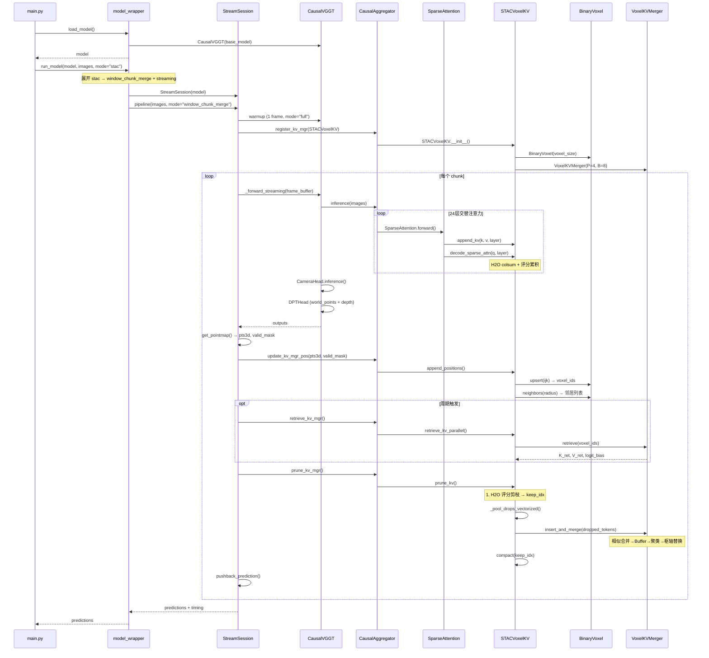
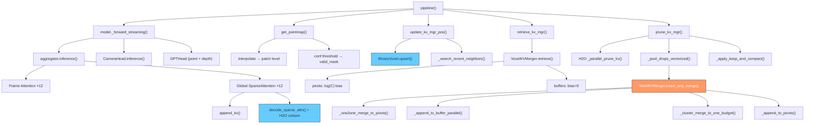

# STAC 代码运行顺序与文件间调用关系

## 总述

STAC 项目的代码运行有**三条主要执行路径**：最小推理（`main.py`）、评估（`eval/*/launch.py`）和批量评估脚本（`run.sh`）。三者最终都汇聚到 `model_wrapper.run_model()` 调度器，由其根据 `streaming` 标志分发到**流式路径**（`StreamSession.pipeline()`）或**非流式路径**（`CausalVGGT.forward()`）。流式路径是项目的核心，又分 `window_kv/causal`（H2O 滑窗）和 `window_chunk_merge`（STAC 体素）两种模式。

---

## 一、Python 文件依赖关系图

```
main.py                          eval/long_recon/launch.py
    │                                    │
    └──────────┬─────────────────────────┘
               │
         model_wrapper.py
               │
       ┌───────┼────────┐
       │       │        │
  stream_session.py     causalvggt/models/vggt.py
       │                       │
       │              causalvggt/models/aggregator.py
       │                       │
       │              ┌────────┼────────┐
       │              │        │        │
       │    causalvggt/layers/  causalvggt/heads/
       │    attention.py        camera_head.py
       │    block.py            dpt_head.py
       │    rope.py             track_head.py
       │    patch_embed.py
       │              │
       └──────┬───────┘
              │
         stac/__init__.py
              │
    ┌─────────┼─────────┐
    │         │         │
kv_manager.py  h2o.py  stac_voxel.py
    │           │           │
    │           │     ┌─────┴──────┐
    │           │     │            │
    │           │  merger.py   voxel.py
    │           │     │
    │           │  allocator.py
    │           │
    │     flash_attn_triton.py
    │
    └── attn-cuda/  (CUDA扩展, 可选)
        merger-cuda/ (CUDA扩展, 可选)
```

**依赖方向**：上层依赖下层，`stac/` 是最底层核心模块，`causalvggt/` 是模型层，`stream_session.py` 和 `model_wrapper.py` 是编排调度层，`main.py` 和 `eval/` 是入口层。

---

## 二、非流式路径运行顺序（`--mode full`，不启用 `--streaming`）

用于训练和全批量推理，一次性处理所有帧。

```
main.py: main()
  │
  ├─1─ parse_args()                        # 解析命令行参数
  ├─2─ load_model("causalvggt", ...)       # model_wrapper.py
  │     ├─ CausalVGGT(base_model)          # causalvggt/models/vggt.py
  │     ├─ _load_checkpoint(ckpt_path)     # 加载 .safetensors/.pt/.pth
  │     └─ _safe_load_state_dict(model, ckpt)  # 严格加载，允许多余键
  ├─3─ load_scene_images(scene_dir, size)  # eval/utils/image.py
  ├─4─ run_model(model, images, ...)       # model_wrapper.py
  │     │
  │     └─ model(images, mode="full", streaming=False)
  │           │                              # CausalVGGT.forward()
  │           ├─4.1─ aggregator(images, mode)
  │           │        # CausalAggregator.forward()
  │           │        ├─ patch_embed(images)         # DINOv2 ViT-L/14
  │           │        ├─ 添加 camera_token + register_token
  │           │        ├─ create_attn_mask(mode)       # block.py
  │           │        └─ 24层交替执行:
  │           │              for each aa_block:
  │           │                if "frame": frame_blocks[i](tokens)
  │           │                  └─ Block.forward()
  │           │                       ├─ Attention.forward()  # QKV + SDPA
  │           │                       └─ MLP + LayerScale + DropPath
  │           │                if "global": global_blocks[i](tokens)
  │           │                  └─ Block.forward()
  │           │                       └─ SparseAttention.forward()
  │           │                            (无 kv_manager，走标准 SDPA)
  │           │        → 返回 aggregated_tokens_list
  │           │
  │           ├─4.2─ CameraHead(aggregated_tokens_list)
  │           │        → pose_enc [B, S, 9]
  │           │
  │           ├─4.3─ DPTHead(aggregated_tokens_list)  # Point Head
  │           │        → world_points [B, S, H, W, 3]
  │           │        → world_points_conf [B, S, H, W]
  │           │
  │           └─4.4─ DPTHead(aggregated_tokens_list)  # Depth Head
  │                    → depth [B, S, H, W, 1]
  │                    → depth_conf [B, S, H, W]
  │
  ├─5─ pose_encoding_to_extri_intri(...)    # 解码相机位姿
  └─6─ unproject_depth_map_to_point_map()   # 深度图 → 3D 点云
```

---

## 三、流式路径运行顺序 — window_kv / causal 模式

启用 `--streaming`，使用 `KVManager` 或 `HeavyHittersKV` 进行滑窗/H2O KV 缓存管理。

```
main.py: main()
  │
  ├─1─ parse_args()
  ├─2─ load_model("causalvggt", ...)       # 同上
  ├─3─ load_scene_images(...)
  │
  └─4─ run_model(model, images, mode="window_kv", streaming=True, ...)
        │                                    # model_wrapper.py
        ├─4.0─ StreamSession(model, device)  # stream_session.py
        │
        └─4.1─ session.pipeline(images, mode)
              │
              ├── 预热 ── model(images[0:1], mode="full", streaming=True)
              │              └─ CausalVGGT._forward_streaming()
              │
              ├── register_kv_mgr("window_kv", images, KVManager, ...)
              │     ├─ 计算 token_per_frame = img_tokens + cam_tokens
              │     ├─ 计算 buffer_size = chunk + pinned + recent + hh
              │     └─ aggregator.register_kv_mgr(KVManager, ...)
              │           ├─ 为每个 global_blocks[i].attn 设置 layer_idx
              │           ├─ 创建 KVManager(num_layers=24, ...)
              │           └─ kv_manager.reset()  # 分配 GPU 缓冲区
              │
              └── 逐帧循环 (外层 transfer_chunk, 内层 chunk):
                    │
                    for transfer_start in range(0, num_frames, transfer_chunk):
                      for local_offset in range(0, transfer_count, chunk_size):
                        │
                        ├─A─ model(images=frame_buffer, mode="full",
                        │          streaming=True, is_anchor_exist=...)
                        │       │   # CausalVGGT._forward_streaming()
                        │       │
                        │       ├─A.1─ aggregator.inference(images, mode)
                        │       │        # CausalAggregator.inference()
                        │       │        ├─ patch_embed(images)
                        │       │        ├─ 添加 camera_token + register_token
                        │       │        ├─ create_attn_mask(mode)
                        │       │        └─ 24层交替执行:
                        │       │              Frame Attention (Attention):
                        │       │                标准 QKV + SDPA（帧内）
                        │       │              Global Attention (SparseAttention):
                        │       │                ├─ qkv_proj(x)
                        │       │                ├─ kv_manager.append_kv(k, v, layer_idx)
                        │       │                │     # 追加到 GPU 热缓存 [L, H, T_buf, D]
                        │       │                │     # 若超限则溢出到 CPU
                        │       │                └─ kv_manager.decode_sparse_attn(q, layer_idx)
                        │       │                      # HeavyHittersKV 重写此方法:
                        │       │                      ├─ 调用 flash_attn_bias_colsum (CUDA)
                        │       │                      │   或 fa_forward_colsum_fast_sub (Triton)
                        │       │                      ├─ 返回 attn_output + col_sum
                        │       │                      └─ _update_scores(col_sum)
                        │       │                           # 累积 H2O 评分:
                        │       │                           # s_hot = τ·s_old + (1-τ)·s_new
                        │       │        → 返回 aggregated_tokens_list
                        │       │
                        │       ├─A.2─ CameraHead.inference(agg_tokens)
                        │       │        → pose_enc
                        │       │
                        │       ├─A.3─ DPTHead (Point Head)
                        │       │        → world_points, world_points_conf
                        │       │
                        │       └─A.4─ DPTHead (Depth Head)
                        │                → depth, depth_conf
                        │
                        ├─B─ camera_head_inference(...)  # 当 cam_cache_update=False
                        │     └─ CameraHead.inference(pose_token_cache)
                        │
                        ├─C─ aggregator.prune_kv_mgr()
                        │     └─ kv_manager.prune_kv()
                        │           └─ 逐层 _prune_kv(slot_idx)
                        │                 ├─ 保留: recent 帧 + pinned 帧
                        │                 ├─ (HeavyHittersKV 额外) Top-K H2O 高分帧
                        │                 └─ _apply_keep_and_compact()
                        │                       # 并行 gather → compact 到缓冲区前端
                        │
                        ├─D─ pushback_prediction(outputs)  # 累积预测
                        └─E─ _update_benchmark(timing)     # 累积计时
```

**关键调用链（window_kv/causal 每帧）**：

```
model._forward_streaming()
  → aggregator.inference()
    → SparseAttention.forward()
      → kv_manager.append_kv()        # 写 K/V 到热缓存
      → kv_manager.decode_sparse_attn() # 读热缓存做注意力 + 累积 H2O 评分
  → CameraHead.inference()
  → DPTHead()
→ aggregator.prune_kv_mgr()
  → kv_manager.prune_kv()
    → _prune_kv()                     # 保留 recent + pinned (+ H2O top-k)
    → _apply_keep_and_compact()       # GPU 并行压缩
```

---

## 四、流式路径运行顺序 — window_chunk_merge (STAC) 模式

这是 STAC 的完整流水线，在 H2O 基础上增加了体素化、空间检索和在线合并。

```
main.py: main()
  │
  ├─1─ parse_args()
  ├─2─ load_model()
  ├─3─ load_scene_images()
  │
  └─4─ run_model(model, images, mode="stac", ...)
        │   # model_wrapper.py: "stac" 展开为:
        │   #   mode="window_chunk_merge", streaming=True
        │   #   win=4, ck=4, hh=2, ret_sz=2, ret_buf=True
        │
        ├─4.0─ StreamSession(model, device)
        │
        └─4.1─ session.pipeline(images, mode="window_chunk_merge")
              │
              ├── 预热 ── model(images[0:1], mode="full", streaming=True)
              │
              ├── register_kv_mgr("window_chunk_merge", images, STACVoxelKV, ...)
              │     ├─ 计算 token_per_frame
              │     ├─ 构建 merger_kwargs:
              │     │     voxel_size=0.05, init_voxels=4096,
              │     │     voxel_buf_cap=8, voxel_piv_cap=4,
              │     │     sim_threshold=0.8, replace_threshold=0.8,
              │     │     score_threshold=0.2, allocator="segment"
              │     ├─ 计算 buffer_size
              │     └─ aggregator.register_kv_mgr(STACVoxelKV, ...)
              │           ├─ 为 global_blocks[i].attn 设置 layer_idx
              │           └─ 创建 STACVoxelKV(...)
              │                 ├─ 继承 HeavyHittersKV.__init__()
              │                 │     └─ 分配 GPU 热缓存 [L, H, T_buf, D]
              │                 ├─ 创建 BinaryVoxel(voxel_size)
              │                 │     └─ 初始化空体素表 (GPU)
              │                 └─ 创建 VoxelKVMerger(...)
              │                       ├─ pivots: SegmentedSlabPool [H, V_alloc, P, D]
              │                       ├─ buffer: SegmentedSlabPool [H, V_alloc, B, D]
              │                       └─ _stac_merger: MergerWrapper (CUDA, 可选)
              │
              └── 逐帧循环 (外层 transfer_chunk, 内层 chunk):
                    │
                    for transfer_start in range(0, num_frames, transfer_chunk):
                      for local_offset in range(0, transfer_count, chunk_size):
                        │
                        ├─A─ model(images=frame_buffer, mode="full",
                        │          streaming=True, is_anchor_exist=...)
                        │       │   # CausalVGGT._forward_streaming()
                        │       │
                        │       ├─A.1─ aggregator.inference(images, mode)
                        │       │        ├─ patch_embed(images)
                        │       │        ├─ 添加 token
                        │       │        └─ 24层交替执行:
                        │       │              Global Attention (SparseAttention):
                        │       │                ├─ qkv_proj(x)
                        │       │                ├─ kv_manager.append_kv(k, v, layer)
                        │       │                │     # STACVoxelKV 继承 HeavyHittersKV
                        │       │                └─ kv_manager.decode_sparse_attn(q, layer)
                        │       │                      # H2O colsum + 评分累积
                        │       │        → aggregated_tokens_list
                        │       │
                        │       ├─A.2─ CameraHead.inference() 或跳过
                        │       ├─A.3─ DPTHead (world_points + depth)
                        │       └─A.4─ 返回 outputs
                        │
                        ├─B─ camera_head_inference(...)  # 若 cam_cache_update=False
                        │     └─ 取 agg_tokens[-1] → CameraHead.inference()
                        │
                        ├─C─ get_pointmap(outputs, conf_threshold, ...)
                        │     ├─ 提取 world_points [S, 3, H, W]
                        │     ├─ interpolate 降采样到 patch 级别
                        │     ├─ reshape → [S, H'*W', 3]
                        │     └─ valid_mask = pts3d_conf > conf_threshold
                        │
                        ├─D─ aggregator.update_kv_mgr_pos(pts3d, valid_mask)
                        │     └─ kv_manager.append_positions(new_positions, new_pos_mask)
                        │           # STACVoxelKV.append_positions():
                        │           ├─ ijk = floor(position / voxel_size)  # 量化
                        │           ├─ BinaryVoxel.upsert(ijk)
                        │           │     ├─ _pack_keys_1d(ijk) → 1D键编码
                        │           │     ├─ searchsorted 二分查找
                        │           │     ├─ 新体素: 追加到主表 + 重算 Morton 分区
                        │           │     └─ 返回 stable voxel IDs
                        │           ├─ _token_voxel_indices[layer] = voxel_ids
                        │           └─ _search_recent_neighbors()
                        │                 ├─ 取最近 R 个帧的 voxel_ids
                        │                 ├─ BinaryVoxel.neighbors(radius=2*voxel_size)
                        │                 │     └─ Chebyshev 立方体搜索
                        │                 └─ 缓存邻居体素列表
                        │
                        ├─E─ aggregator.retrieve_kv_mgr()  # 周期触发
                        │     └─ kv_manager.retrieve_kv_parallel()
                        │           # STACVoxelKV.retrieve_kv_parallel():
                        │           ├─ 获取邻居体素 ID 列表
                        │           ├─ VoxelKVMerger.retrieve(voxel_ids)
                        │           │     ├─ _merger_cuda_retrieve()  # CUDA 路径
                        │           │     │     ├─ pivots ← retrieve_seg(voxel_ids)
                        │           │     │     ├─ buffers ← retrieve_buf_seg(voxel_ids)
                        │           │     │     └─ concat + logit_bias = log(C)
                        │           │     └─ 或 Python 路径:
                        │           │           ├─ pivots.read_rows_dict()
                        │           │           ├─ 按 W 降序排列
                        │           │           └─ logit_bias[valid] = log(C)
                        │           └─ 填充 key_cache_retrieval[layer]
                        │                 # 下一次 decode_sparse_attn 时,
                        │                 # 检索缓存拼接到热缓存末尾
                        │
                        ├─F─ aggregator.prune_kv_mgr()
                        │     └─ kv_manager.prune_kv()
                        │           # STACVoxelKV.prune_kv():
                        │           ├─ HeavyHittersKV._parallel_prune_kv()
                        │           │     ├─ 保留: recent + pinned + Top-K H2O
                        │           │     └─ 生成 keep_idx [L, H, T']
                        │           │
                        │           ├─ _pool_drops_vectorized()  ← 关键步骤
                        │           │     ├─ 提取被驱逐令牌的 K/V/scores/voxel_ids
                        │           │     ├─ 按体素 ID 排序分组
                        │           │     └─ VoxelKVMerger.insert_and_merge()
                        │           │           │
                        │           │           ├─ 排序: rows = h * V_alloc + v
                        │           │           │
                        │           │           ├─ [Python 路径]
                        │           │           │   _insert_and_merge_fusion():
                        │           │           │   ├─ 拼接溢出令牌
                        │           │           │   ├─ _one2one_merge_to_pivots()
                        │           │           │   │     ├─ 计算 cos(k_i, pivot_seed)
                        │           │           │   │     ├─ sim≥threshold → 加权平均合并
                        │           │           │   │     ├─ sim<threshold 且高分 → 标记为 buffer
                        │           │           │   │     └─ 其他 → 丢弃
                        │           │           │   ├─ _append_to_buffer_parallel()
                        │           │           │   │     └─ Top-B 选择
                        │           │           │   ├─ Buffer 满 → _cluster_merge_to_one_budget()
                        │           │           │   │     ├─ 取最高分令牌为种子
                        │           │           │   │     ├─ Weighted-FPS 聚类
                        │           │           │   │     └─ 生成新枢轴
                        │           │           │   └─ _append_to_pivots()
                        │           │           │         ├─ 槽位不够 → 合并最轻枢轴到邻居
                        │           │           │         └─ 写入新枢轴
                        │           │           │
                        │           │           └─ [CUDA 路径]
                        │           │               _insert_and_merge_fused_cuda/_seg():
                        │           │               └─ MergerWrapper.insert_and_merge_with_rows()
                        │           │                     # GPU 单内核融合全部操作
                        │           │
                        │           └─ _apply_keep_and_compact(keep_idx)
                        │                 # 并行压缩热缓存
                        │
                        ├─G─ 周期性 CUDA 缓存清理 (每 4*chunk 帧)
                        │     └─ torch.cuda.empty_cache()
                        │
                        ├─H─ pushback_prediction(outputs)
                        └─I─ _update_benchmark(timing)
```

**STAC 模式每帧完整调用链**：

```
StreamSession.pipeline()
  │
  ├── model._forward_streaming()          # 模型前向
  │     ├── aggregator.inference()
  │     │     ├── patch_embed             # 图像 → patches
  │     │     ├── Frame Attention × 12    # 帧内 SDPA
  │     │     └── Global Attention × 12   # 帧间 SparseAttention
  │     │           ├── kv_manager.append_kv()         # 写 K/V
  │     │           └── kv_manager.decode_sparse_attn() # 读 + H2O 评分
  │     ├── CameraHead.inference()        # 位姿编码
  │     └── DPTHead()                     # 深度 + 点云
  │
  ├── camera_head_inference()             # 独立相机头推理
  │
  ├── get_pointmap()                      # 3D 点云提取 + 降采样
  │     └── interpolate + reshape + conf 过滤
  │
  ├── aggregator.update_kv_mgr_pos()      # 更新空间位置
  │     └── STACVoxelKV.append_positions()
  │           ├── BinaryVoxel.upsert()    # 3D → 体素 ID
  │           └── _search_recent_neighbors() # 空间邻居搜索
  │
  ├── aggregator.retrieve_kv_mgr()        # 周期: 检索邻居枢轴
  │     └── STACVoxelKV.retrieve_kv_parallel()
  │           └── VoxelKVMerger.retrieve()
  │                 └── 枢轴 + log(C) bias
  │
  └── aggregator.prune_kv_mgr()           # 剪枝 + 驱逐到体素池
        └── STACVoxelKV.prune_kv()
              ├── HeavyHittersKV._parallel_prune_kv()  # H2O 评分剪枝
              ├── _pool_drops_vectorized()              # 驱逐 → 合并
              │     └── VoxelKVMerger.insert_and_merge()
              │           ├── _one2one_merge_to_pivots()  # 相似合并
              │           ├── _append_to_buffer_parallel() # Buffer 追加
              │           ├── _cluster_merge_to_one_budget() # 聚类新枢轴
              │           └── _append_to_pivots()          # 枢轴替换
              └── _apply_keep_and_compact()              # 压缩热缓存
```

---

## 五、评估路径运行顺序

三大评估任务的执行流程与 `main.py` 类似，差异在于数据加载和评估指标计算。

### 5.1 3D 重建评估

```
eval/long_recon/launch.py: main()
  │
  ├─1─ parse_args()
  ├─2─ load_model("causalvggt", ...)
  ├─3─ 根据 dataset_type 实例化数据集:
  │      SevenScenes / NRGBD / DTU  (data.py)
  │     → 返回 batch_data (含 GT pts3d, valid_mask, camera_pose)
  │
  ├─4─ run_model(model, images, ...)     # 同 main.py
  │
  ├─5─ eval_scene(batch_data, predictions, dataset_type)
  │     │                                 # eval_utils.py
  │     ├─ Regr3D_t_ScaleShiftInv 准则:
  │     │     ├─ get_all_pts3d_t() → 尺度偏移不变对齐
  │     │     └─ 使用 L21 (欧几里得距离) 评估
  │     │
  │     ├─ crop 224×224 中心区域
  │     ├─ ICP 对齐 (Cupoch GPU / Open3D CPU)
  │     │     └─ Point-to-Plane ICP (GPU) 或 Point-to-Point (CPU)
  │     │
  │     ├─ pcd.estimate_normals()
  │     └─ accuracy() + completion()  # eval/utils/metrics.py
  │           ├─ KD-Tree 查询
  │           ├─ Acc: mean(min_dist(rec_pt, GT))
  │           ├─ Comp: mean(min_dist(GT_pt, rec))
  │           └─ NC: |n_rec · n_gt_nn|
  │
  └─6─ 保存 JSON 指标 + 可视化
```

### 5.2 相机位姿评估

```
eval/cam_pose/launch.py: main()
  │
  ├─1─ parse_args()
  ├─2─ load_model()
  ├─3─ 加载数据集 (Sintel / ScanNet / TUM)
  │     └─ dataset_metadata 驱动数据加载
  │
  ├─4─ run_model(model, images, ...)
  │     └─ 返回 predictions["pose_enc"]
  │
  ├─5─ pose_encoding_to_extri_intri() → 外参矩阵
  │
  └─6─ eval_traj(pred_traj, gt_traj)
        │                               # eval_utils.py
        ├─ make_traj() → PoseTrajectory3D
        ├─ sync.associate_trajectories() # 时间同步
        ├─ main_ape.ape()                # ATE:
        │     ├─ Horn 对齐 (旋转+平移+尺度)
        │     └─ 统计: rmse, mean, median, std, min, max
        │
        └─ main_rpe.rpe(delta=1)         # RPE:
              ├─ 平移分量 (m)
              └─ 旋转分量 (deg)
```

### 5.3 视频深度评估

```
eval/video_depth/launch.py: main()
  │
  ├─1─ parse_args()
  ├─2─ load_model()
  ├─3─ 加载数据集 (Sintel/KITTI/Bonn/NYU/ScanNet)
  │     └─ dataset_metadata + process_func
  │
  ├─4─ run_model(model, images, ...)
  │     └─ 返回 predictions["depth"]
  │
  ├─5─ save_depth_maps()                # 保存可视化深度图
  │
  └─6─ eval_depth.py: eval_depth()      # 深度指标计算
        │
        ├─ 预处理: 过滤 GT > max_depth, 过滤离群值
        ├─ 对齐 (可选):
        │     ├─ median scaling: d' = d * median(gt)/median(pred)
        │     ├─ least squares: d' = s*d + t (解析解)
        │     ├─ LAD: d' = s*d + t (Adam 优化)
        │     └─ iterative reweighted (Weiszfeld)
        │
        └─ 计算指标:
              ├─ AbsRel  = mean(|pred - gt| / gt)
              ├─ SqRel   = mean((pred - gt)² / gt)
              ├─ RMSE    = sqrt(mean((pred - gt)²))
              ├─ LogRMSE = sqrt(mean((log(pred) - log(gt))²)
              └─ δ<threshold: max(pred/gt, gt/pred) < threshold
```

---

## 六、文件间调用关系速查表

| 调用方文件 | 被调用方文件 | 调用内容 |
|-----------|-------------|---------|
| `main.py` | `model_wrapper.py` | `load_model()`, `run_model()` |
| `main.py` | `eval/utils/image.py` | `load_scene_images()` |
| `main.py` | `causalvggt/utils/pose_enc.py` | `pose_encoding_to_extri_intri()` |
| `main.py` | `causalvggt/utils/geometry.py` | `unproject_depth_map_to_point_map()` |
| `model_wrapper.py` | `stream_session.py` | `StreamSession` |
| `model_wrapper.py` | `causalvggt/models/vggt.py` | `CausalVGGT` |
| `stream_session.py` | `stac/kv_manager.py` | `KVManager` |
| `stream_session.py` | `stac/stac_voxel.py` | `STACVoxelKV` |
| `stream_session.py` | `causalvggt/utils/geometry.py` | `unproject_depth_map_to_point_map()` |
| `stream_session.py` | `causalvggt/utils/pose_enc.py` | `pose_encoding_to_extri_intri()` |
| `causalvggt/models/vggt.py` | `causalvggt/models/aggregator.py` | `CausalAggregator` |
| `causalvggt/models/vggt.py` | `causalvggt/heads/camera_head.py` | `CameraHead` |
| `causalvggt/models/vggt.py` | `causalvggt/heads/dpt_head.py` | `DPTHead` |
| `causalvggt/models/vggt.py` | `causalvggt/heads/track_head.py` | `TrackHead` |
| `causalvggt/models/aggregator.py` | `causalvggt/layers/block.py` | `Block`, `create_attn_mask()` |
| `causalvggt/models/aggregator.py` | `causalvggt/layers/attention.py` | `SparseAttention`, `Attention` |
| `causalvggt/models/aggregator.py` | `causalvggt/layers/rope.py` | `RotaryPositionEmbedding2D` |
| `causalvggt/models/aggregator.py` | `causalvggt/layers/patch_embed.py` | `PatchEmbed` |
| `causalvggt/models/aggregator.py` | `stac/h2o.py` | `HeavyHittersKV` (注册时) |
| `causalvggt/layers/attention.py` | `stac/kv_manager.py` | `kv_manager.append_kv()`, `decode_sparse_attn()` |
| `stac/stac_voxel.py` | `stac/h2o.py` | `HeavyHittersKV` (父类) |
| `stac/stac_voxel.py` | `stac/voxel.py` | `BinaryVoxel` |
| `stac/stac_voxel.py` | `stac/merger.py` | `VoxelKVMerger` |
| `stac/h2o.py` | `stac/kv_manager.py` | `KVManager` (父类) |
| `stac/h2o.py` | `stac/flash_attn_triton.py` | `fa_forward_colsum_fast_sub()` |
| `stac/h2o.py` | `attn_cuda` | `flash_attn_bias_colsum()` (可选) |
| `stac/merger.py` | `stac/allocator.py` | `BufferInterface`, `create_buffer()` |
| `stac/merger.py` | `merger_cuda` | `create_merger_wrapper()` (可选) |
| `eval/long_recon/launch.py` | `eval/long_recon/data.py` | `SevenScenes`, `NRGBD`, `DTU` |
| `eval/long_recon/launch.py` | `eval/long_recon/eval_utils.py` | `eval_scene()`, `eval_depth()`, `eval_traj()` |
| `eval/long_recon/eval_utils.py` | `eval/utils/metrics.py` | `accuracy()`, `completion()` |
| `eval/long_recon/eval_utils.py` | `eval/long_recon/criterion.py` | `Regr3D_t_ScaleShiftInv`, `L21` |
| `eval/cam_pose/launch.py` | `eval/cam_pose/utils.py` | `get_tum_poses()` |
| `eval/cam_pose/launch.py` | `eval/cam_pose/evo_utils.py` | evo 库集成 |
| `eval/video_depth/eval_depth.py` | `eval/utils/metrics.py` | `absolute_value_scaling()`, `absolute_value_scaling2()` |

---

## 七、Mermaid 运行时序图



### STAC 单帧内部调用链（简化）


