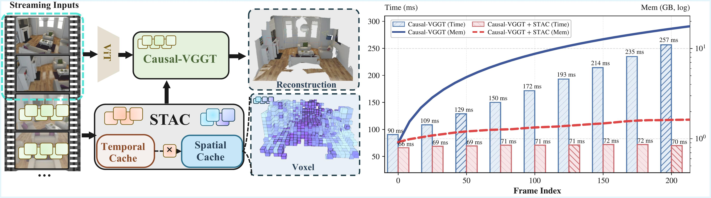

<div align="center">
<h1>STAC: Plug-and-Play Spatio-Temporal Aware Cache Compression for Streaming 3D Reconstruction</h1>

<a href="https://arxiv.org/pdf/2603.20284" target="_blank" rel="noopener noreferrer">
  
</a>
<a href="https://arxiv.org/abs/2603.20284">
  
</a>
<a href="https://stac-3r.github.io/">
  
</a>
<a href="https://github.com/Rainzor/STAC">
  
</a>

**[University of Science and Technology of China](https://en.ustc.edu.cn/)**

[Runze Wang](https://rainzor.github.io/), Yuxuan Song, Youcheng Cai, [Ligang Liu](http://staff.ustc.edu.cn/~lgliu/)


</div>

```bibtex
@article{wang2026stac,
  title={STAC: Plug-and-Play Spatio-Temporal Aware Cache Compression for Streaming 3D Reconstruction},
  author={Wang, Runze and Song, Yuxuan and Cai, Youcheng and Liu, Ligang},
  journal={arXiv preprint arXiv:2603.20284},
  year={2026}
}
```

---

- [Overview](#overview)
- [Installation](#installation)
- [Preparation](#preparation)
- [Quick Start](#quick-start)
- [Evaluation](#evaluation)

## 📖 Overview

**STAC** is a **plug-and-play** KV-cache compression framework for memory-efficient streaming 3D reconstruction over long videos. It compresses evicted KV-cache tokens into a spatio-temporal voxel memory and retrieves relevant pivots on demand, enabling bounded-memory long-range spatial reasoning.


Feed-forward 3D models such as [STream3R](https://github.com/NIRVANALAN/STream3R) and [StreamVGGT](https://github.com/wzzheng/StreamVGGT) scale poorly on long videos due to $O(N)$ attention memory. Sliding-window attention avoids OOM but loses long-range context. **STAC** keeps memory bounded while restoring long-range spatial recall by merging evicted KV tokens into a 3D voxel memory and retrieving the most relevant pivots during streaming.


| Capability         | Causal         |  Window           | **STAC (Ours)**           |
| ------------------ | -------------- | ----------------- | ------------------------- |
| Attention          | All frames     | Sliding window    | Window + voxel retrieval  |
| Memory scaling     | $O(N)$         | $O(W)$ fixed window | $O(W)$ + bounded voxel pool |
| Long-video support | ✗ (OOM)        | ✓ (no history)    | ✓ (with spatial memory)   |



*Overview: STAC with Causal-VGGT and runtime-memory scaling.*


**Supported backbones** (switch via `--base_model`): [STream3R](https://github.com/NIRVANALAN/STream3R) (`stream3r`) and [StreamVGGT](https://github.com/wzzheng/StreamVGGT) (`streamvggt`).

### Key Features

- **Plug-and-play**: Switch backbones via `--base_model` with no code changes.
- **Memory-constrained**: Temporal cache + voxel memory keeps KV growth bounded on long streams.
- **Efficient inference**: Chunk-based `StreamSession` with optional CUDA backends for stable latency and higher throughput.

### Code Structure

```text
STAC/
├── main.py                    # Minimal inference entry point
├── model_wrapper.py           # load_model() / run_model() API
├── stream_session.py          # Chunk-by-chunk streaming session
├── requirements.txt
├── stac/                      # STAC KV-cache compression (plug-and-play)
│   ├── kv_manager.py          #   Sliding window + H2O token selection
│   ├── h2o.py                 #   Heavy-hitter scoring
│   ├── stac_voxel.py          #   Voxel pool: evict -> merge -> retrieve
│   ├── merger.py              #   Token merging operations
│   ├── voxel.py               #   Voxel grid utilities
│   ├── allocator.py           #   Static / slab / segment allocators
│   └── flash_attn_triton.py   #   Triton attention kernel
├── causalvggt/                # Causal-VGGT adapter
├── attn-cuda/                 # Custom CUDA attention kernel
└── merger-cuda/               # Custom CUDA merger kernel
```

### Pipeline Diagram

```text
┌────────────────────────────────────────────────────────┐
│  Backbone (interchangeable)                            │
│  ┌─────────────┐ ┌─────────────┐ ┌─────────────────┐   │
│  │  STream3R   │ │ StreamVGGT  │ │    (others)     │   │
│  └──────┬──────┘ └──────┬──────┘ └────────┬────────┘   │
│         └───────────────┼─────────────────┘            │
│                         ▼                              │
│  CausalVGGT Adapter (vggt.py)                          │
│  ┌─────────────────────────────────────────────────┐   │
│  │ CausalAggregator (24-layer ViT-L)               │   │
│  │   └─ SparseAttention -> kv_manager (registered) │   │
│  │ CameraHead -> extrinsic + intrinsic             │   │
│  │ DPTHead (x2) -> depth map + point map           │   │
│  └─────────────────────────────────────────────────┘   │
└─────────────────────────────┬──────────────────────────┘
                              │ KV pairs
                              ▼
┌─────────────────────────────────────────────────────────┐
│  STAC KV-Cache (stac/)  <- plug-and-play                │
│  ┌───────────────────────────────────────────────────┐  │
│  │ KVManager   sliding window (recent + pinned)      │  │
│  │ ├ H2O       heavy-hitter selection                │  │
│  │ └ STACVoxel 3D voxel pool: evict->merge->retrieve │  │
│  └───────────────────────────────────────────────────┘  │
└─────────────────────────────┬───────────────────────────┘
                              │
                              ▼
┌─────────────────────────────────────────────────────────┐
│  StreamSession (stream_session.py)                      │
│  Chunk-by-chunk inference + prediction accumulation     │
└─────────────────────────────────────────────────────────┘
```

## 🛠️ Installation

> **Tested GPUs:** NVIDIA RTX 3090 (24 GB) and A100 (40 GB).

```bash
git clone https://github.com/Rainzor/STAC.git
cd STAC
conda create -n stac python=3.11 cmake=3.14.0 -y
conda activate stac
```

Install [PyTorch](https://pytorch.org/get-started/locally/) for your CUDA (e.g. `cu128` or `cu118`), then dependencies:

```bash
# Example: CUDA 12.8
pip install torch==2.7.0+cu128 torchvision==0.22.0+cu128 torchaudio==2.7.0+cu128 \
--index-url https://download.pytorch.org/whl/cu128 

pip install -r requirements.txt
```

### CUDA KV merger (`merger-cuda`)

`merger-cuda` is an optional CUDA extension for faster voxel merging (`--voxel_backend cuda`).

Build from repo root (with `CUDA_HOME` set):

```bash
pip install -e merger-cuda --no-build-isolation
```

### CUDA attention extension (`attn-cuda`)

`attn-cuda` is an optional CUDA extension used by STAC attention decoding. It provides:

- FlashAttention forward (`out`, `lse`)
- Optional vector bias (`[B,H,N]` / `[B,H,1,N]` / `[1,H,1,N]`)
- Optional column-sum (`colsum`) for retrieval scoring
- Optional colsum subsampling (`subsample_ratio`)

Build from repo root:

```bash
pip install -e attn-cuda --no-build-isolation
```

## 📦 Preparation

Prepare checkpoints and datasets in the following layout so the evaluation and inference scripts can find them directly.

### Download Links

[](https://huggingface.co/yslan/STream3R)
[](https://huggingface.co/datasets/yslan/pointmap_regression_evalsets)

### Checkpoints

Place backbone weights under `ckpt/{stream3r|streamvggt}/` as `model.safetensors`, `model.pt`, or `model.pth` (auto-detected by `model_wrapper.py`).


| Backbone   | Hugging Face                                                      |
| ---------- | ----------------------------------------------------------------- |
| STream3R   | [yslan/STream3R](https://huggingface.co/yslan/STream3R) (default) |
| StreamVGGT | [lch01/StreamVGGT](https://huggingface.co/lch01/StreamVGGT)       |

```bash
# Download at least one backbone (run from repo root)
mkdir -p ckpt/stream3r && hf download yslan/STream3R --local-dir ckpt/stream3r
# StreamVGGT: mkdir -p ckpt/streamvggt && hf download lch01/StreamVGGT --local-dir ckpt/streamvggt
# Use HF_ENDPOINT=https://hf-mirror.com for mirrors.
```

### Datasets

Put scenes under `data/` with layout `data/<dataset>/<scene>/images/*.png`, for example `data/7scenes/chess/images/`.

- Supported datasets: `7scenes`, `neural_rgbd`, `DTU`, `tum`, `scannet`, `sintel`, `bonn`, `kitti`, preprocessing follows [CUT3R](https://github.com/CUT3R/CUT3R/blob/main/docs/preprocess.md)
- Ready-to-use evaluation sets are available on [🤗 Hugging Face datasets](https://huggingface.co/datasets/yslan/pointmap_regression_evalsets)

**Suggested layout:**

```text
STAC/                          # run all commands from repo root
├── ckpt/
│   ├── stream3r/
│   │   └── model.safetensors   # or model.pt / model.pth
│   └── streamvggt/
│       └── model.safetensors
├── data/
│   └── <dataset>/<scene>/images/*.png
├── eval_recon/                 # 3D recon output (created by launch)
├── eval_cam_results/           # pose output
└── eval_depth/                 # depth output
```

## 🚀 Quick Start

### Python API

Run from repo root. Example script:

```python
import torch
from pathlib import Path
from eval.utils.image import load_scene_images
from model_wrapper import load_model, run_model

device = "cuda" if torch.cuda.is_available() else "cpu"
dtype = torch.bfloat16 if device == "cuda" and torch.cuda.get_device_capability()[0] >= 8 else torch.float16

scene_dir = Path("data/neural_rgbd/whiteroom")  # should contain images/*.png or *.jpg

# Use the same resize/crop pipeline as eval launch scripts.
images = load_scene_images(scene_dir, size=518)[::10]

# Pick any supported backbone: "stream3r" or "streamvggt"
model = load_model("causalvggt", base_model="stream3r", device=device)
# Optional: override checkpoint location (file or directory)
# model = load_model("causalvggt", base_model="stream3r", device=device, model_path="/path/to/model.pth")

# mode="stac" auto-enables streaming + recommended STAC params
with torch.no_grad(), torch.amp.autocast(device_type="cuda", dtype=dtype):
    predictions = run_model(
        model=model,
        images=images,
        model_name="causalvggt",
        mode="stac",
        streaming=True,
        dtype=dtype,
        device=device,
        pinned=[0],  # required by streaming STAC path
    )
# predictions keys: extrinsic, intrinsic, depth, depth_conf,
#                   world_points, world_points_conf, timing, merger, ...
```

Switching backbones is a one-line change:

```python
# Use StreamVGGT backbone instead
model = load_model("causalvggt", base_model="streamvggt", device=device)
```

### Command line

`main.py` provides a minimal inference example on a scene folder. Scene dirs need an `images/` subfolder with `.png` or `.jpg` files. Eval scripts (see [Evaluation](#evaluation)) add dataset loading and metrics on top of the same interface.

```shell
# Minimal run (default mode is STAC)
python main.py --scene_dir /path/to/scene

# Full attention baseline (no streaming)
python main.py --scene_dir /path/to/scene --mode full

# Explicit STAC configuration (equivalent to --mode stac)
python main.py --scene_dir /path/to/scene \
  --base_model stream3r --streaming \
  --mode window_chunk_merge \
  -win 4 -ck 4 -hh 2 -ret_sz 2 -ret_buf

# Use StreamVGGT backbone
python main.py --scene_dir /path/to/scene --base_model streamvggt --mode stac
```

<details>
<summary><span style="font-weight: bold;">Command Line Arguments for main.py</span></summary>

  #### --scene_dir
  Path to the scene directory containing an ```images/``` subfolder. Required.
  #### --output_dir
  Directory to save outputs. Default: same as ```--scene_dir```.
  #### --base_model
  Backbone weights to use: ```stream3r``` or ```streamvggt```. Default: ```stream3r```.
  #### --size
  Input resolution. Choices: ```224```, ```512```, ```518```. Default: ```518```.
  #### --kf_every
  Sample every k frames for limited memory inference. Default: ```10```.
  #### --mode
  Attention mode (```stac```, ```full```, ```causal```, ```window_kv```, ```window_chunk_merge```, ...). Default: ```stac```.
  #### --streaming
  Enable frame-by-frame streaming via ```StreamSession```. Off by default (auto-enabled by ```--mode stac```).
  #### --dtype
  Autocast dtype: ```auto```, ```fp16```, or ```bf16```. ```auto``` selects ```bf16``` on Ampere+ GPUs, otherwise ```fp16```. Default: ```auto```.
  #### --window_size / -win
  Sliding KV window size in frames. Default: ```0```.
  #### --chunk_size / -ck
  Number of frames per forward pass. Default: ```1```.
  #### --hh_size / -hh
  Heavy-hitter frames kept by H2O. Default: ```0```.
  #### --retrieval_size / -ret_sz
  Voxel pivots retrieved per step. Default: ```0```.
  #### --retrieve_buf / -ret_buf
  Include retrieved pivots in the returned buffer. Off by default.
  #### --pinned
  Frame indices pinned in the KV cache. Default: ```[0]```.
  #### --temperature
  H2O score temperature. Default: ```0.9```.
  #### --attn_backend
  Sparse decode attention backend: ```cuda``` or ```triton```. Default: ```cuda```.
  #### --subsample
  Colsum subsampling ratio in ```(0, 1]```. Default: ```1.0```.
  #### --voxel_size
  Voxel grid resolution in meters. Default: ```0.05```.
  #### --voxel_num
  Initial voxel pool size. Default: ```4096```.
  #### --voxel_conf
  Confidence threshold for voxel merging. Default: ```2.0```.
  #### --voxel_buf_cap
  Maximum KV entries per buffer voxel. Default: ```8```.
  #### --voxel_piv_cap
  Maximum KV entries per pivot voxel. Default: ```4```.
  #### --voxel_backend
  Voxel backend: ```python``` or ```cuda```. Default: ```cuda```.
  #### --allocator / -alloc
  Voxel allocator: ```static```, ```slab```, or ```segment```. Default: ```segment```.
</details>
<br>

## 📊 Evaluation

Use `--base_model` to switch backbones (`stream3r` or `streamvggt`). Batch scripts run all scenes; single-run scripts let you pick individual scenes. For programmatic use, see `model_wrapper.run_model()` and the `stac` / `stream_session` APIs.

The argument lists below cover only task- and dataset-specific options. All three scripts also accept the same STAC/streaming flags (`--mode`, `--streaming`, `-win`, `-ck`, `-hh`, `-ret_sz`, `--voxel_*`, `--allocator`, `--attn_backend`, etc.); see the [main.py](#command-line) arguments or each script's `--help` for the full set.

### 3D Reconstruction

Batch run: [eval/long_recon/run.sh](eval/long_recon/run.sh)

```shell
# STAC (recommended)
python eval/long_recon/launch.py \
  --dataset_type NRGBD --scene_name complete_kitchen \
  --model_name causalvggt --base_model stream3r \
  --mode stac --streaming

# Custom STAC config
python eval/long_recon/launch.py \
  --dataset_type NRGBD --scene_name complete_kitchen \
  --model_name causalvggt --base_model stream3r \
  --mode window_chunk_merge --streaming \
  -ck 4 -win 4 -hh 2 -ret_sz 2 -ret_buf
```

<details>
<summary><span style="font-weight: bold;">Command Line Arguments for eval/long_recon/launch.py</span></summary>

  #### --model_name
  Model variant. Default: ```causalvggt```.
  #### --base_model
  Backbone to wrap: ```stream3r``` or ```streamvggt```.
  #### --output_dir
  Directory to save evaluation results. Default: ```eval_results/recon```.
  #### --dataset_type
  Dataset to evaluate. Required. Choices: ```7scenes```, ```NRGBD```, ```DTU```.
  #### --scene_name
  Specific scene(s) to evaluate. Default: all scenes.
  #### --size
  Input resolution (long side). Default: ```518```.
  #### --kf_every
  Keyframe sampling interval. Default: ```1```.
  #### --eval_cpu
  Run evaluation on CPU instead of CUDA.
  #### --eval_depth
  Evaluate depth map metrics (print only).
  #### --eval_cam
  Evaluate camera trajectory metrics (print only).
  #### --no_recon
  Disable reconstruction evaluation.
  #### --save_tag / --tag
  Sub-folder tag appended to scene output directory.
  #### --vis_tag
  Tag used in saved metric filenames for distinguishing runs.

</details>
<br>


### Camera Pose Estimation

Batch run: [eval/cam_pose/run.sh](eval/cam_pose/run.sh)

```shell
python eval/cam_pose/launch.py \
  --dataset_type tum \
  --model_name causalvggt --base_model stream3r \
  --mode stac --streaming
```

<details>
<summary><span style="font-weight: bold;">Command Line Arguments for eval/cam_pose/launch.py</span></summary>

  #### --model_name
  Model variant. Default: `causalvggt`.
  #### --base_model
  Backbone to wrap: `stream3r` or `streamvggt`.
  #### --output_dir
  Directory to save evaluation results. Default: `eval_results/all`.
  #### --dataset_type
  Dataset to evaluate. Required. Choices: `sintel`, `tum`, `scannet`.
  #### --scene_name
  Specific scene(s) to evaluate. Default: all scenes.
  #### --size
  Input resolution (long side). Choices: `224`, `512`, `518`. Default: `518`.
  #### --pose_eval_stride
  Stride for pose evaluation. Default: `1`.
  #### --mode
  Attention mode. Default: `stac`. Choices: `stac`, `full`, `causal`, `window_kv`, `window_chunk_merge`.
</details>
<br>


### Video Depth Estimation

Batch run: [eval/video_depth/run.sh](eval/video_depth/run.sh)

```shell
python eval/video_depth/launch.py \
  --eval_dataset sintel \
  --model_name causalvggt --base_model stream3r \
  --mode stac --streaming

python eval/video_depth/eval_depth.py --align scale
```

Note: run `eval_depth.py` after `launch.py` to compute depth metrics with scale alignment.

<details>
<summary><span style="font-weight: bold;">Command Line Arguments for eval/video_depth/launch.py</span></summary>

#### --model_name

  Model variant. Default: `causalvggt`.

#### --base_model

  Backbone to wrap: `stream3r` or `streamvggt`.

#### --output_dir

  Directory to save evaluation results. Default: empty (current directory).

#### --eval_dataset

  Dataset to evaluate. Default: `sintel`. Choices depend on `dataset_metadata`.

#### --seq_list

  List of specific sequences to evaluate. Default: all.

#### --size

  Input resolution (long side). Default: `518`.

#### --pose_eval_stride

  Stride for pose evaluation. Default: `1`.

#### --mode

  Attention mode. Default: `stac`. Choices: `stac`, `full`, `causal`, `window_kv`, `window_chunk_merge`.

</details>
<br>


**Environment variables:** `VERBOSE=1` prints per-frame KV stats; `MERGER_MEM_PROFILE=1` reports CUDA memory fragmentation during cleanup.

## 📝 Acknowledgments

STAC builds upon the following excellent open-source projects and we encourage you to check them out:

[VGGT](https://github.com/facebookresearch/vggt) | [STream3R](https://github.com/NIRVANALAN/STream3R) | [StreamVGGT](https://github.com/wzzheng/StreamVGGT) | [CUT3R](https://github.com/CUT3R/CUT3R) | [Spann3R](https://github.com/HengyiWang/spann3r)
